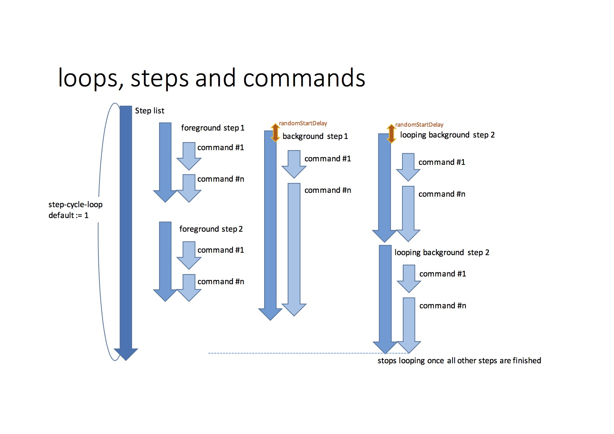

.. aioRunbook documentation master file, created by
   sphinx-quickstart on Wed Dec 27 07:56:16 2017.
   You can adapt this file completely to your liking, but it should at least
   contain the root `toctree` directive.

.. toctree::
   :hidden:

   api

Overview
========

aioRunbook (`asyncio <https://docs.python.org/3/library/asyncio.html>`_ runbook) is a 
Python package providing an orchestration framework for automated 
network tests and network migrations using supporting libraries like asyncssh, netconf and snmp 
for interaction with the netwok elements.

aioRunbook is designed to be controlled by either shell execution respectively an 
aihttp web microservice. 

.. warning::

    the aiohttp based web control app is not yet included.

Use cases for aioRunbook are:

* automated lab tests for recurring test scenarios
* automated network migrations based on sequencial test steps with the option of a rollback functionality

aioRunbook is explicitly designed for customizable inspection of the results of scheduled test/migration steps in a sequence of 
test steps. Each test step interacts with just one single device. 
aioRunbook is designed to document the test/migration results in customizable PDF/HTML outputs.

All characteristics of the test sequence and the behaviour of the io-adapters to the network 
devices is controlled by a single config file.

The results of the aioRunbook steps are stored intermediately in an internal data 
structures, which can be exported as JSON file, for further processing like:

* rendering to PDF documents
* dispatching the results in a web app

Concept of a YAML config
========================

The aioRunbook configuration is defined in a single YAML file. During the execution of the test/migration,
the data structure is enriched with the output of the network interactions.

The concept allows the flexibility to add additional attributes on demand. Adapters, analyzers, or rendering 
(PDF/HTML) can access those attributes as those have access to the complete data structure.

.. code-block:: yaml
    
    config:
      <global variables in the valueMatrix>
      <global attribute for host-file>
      <global attributes for the test/migration>
      steps:
        - <step-type 1>
            <step-type 1 attributes>
           commands:
              - <step-type 1 commands>
        - <step-type n>
            <step-type n attributes>
            commands:
              - <step-type n commands>
      pdfOutput:
          <attributes for PDF output>

.. note::

    In the future a web based editor for aioRunbook YAML config files might be available.

Concept of Test Steps
=====================

A test step comprehends an execution step on a single device. During a test step one or 
more commands be executed on the specific device. The commands are provided with a list of
strings, respectively with a list of objects for specific adaptors. In general the device 
parameters are referenced by the first word of the step attribute name. Optionally the 
the output (text, json, xml or API data) can be validated with customizable 
verification criteria. Based on experience is a good habit to verify the test step output
if possible.

.. _stepTypes:
.. figure::  images/overview1.jpg
   :align:   center

Following Step Types are implemented:

* **record**: executes a list (with one ore more list-elements) of commands and records the output of CLI commands
* **config**: similar to record, executes a list CLI commands. Was used to differentiate in PDF post processing, might be deprecated in the future.
* **check**: executes a list commands and checks the result of one command by an appropriate analyzer. By default the output of the last command is checked.
* **await**: performs periodical checks and performs an output check until the result is ''pass'', respectively the give-up-timer has expired.
* **copy**: sFTP file transfer to/from the network elements
* **sleep**: waits a configurable period of time before continuing with the next step.
* **break**: waits for a user input (return) before continuing with the next step
* **comment**: includes text-comments, text-segments, pre-recorded screenshots and file attachments. The later is a handy tool to document
    complete router configurations in the PDF output.

.. warning::

    follwoing step types still need to be ported to asyncio:

    * comment

This an example of the aioRunbook steps:

.. code-block:: yaml
    
    config:
      steps:
        - record:
            name: "<DUT> - <test step summary line>"
            commands: 
              - <command #1>
              - <command #n>
        - check:
            name: "<DUT> - <test step summary line>"
            commands: 
              - <command #1>
              - <command #n>
            # option for CLI output verification
            textFSMOneLine: '(.*Hostname\: MX1.*) 1'
            # option for JSON output verification
            jsonOneLine: '[some] == "data"'
        - await:
            name: "<DUT> - <test step summary line>"
            give-up-timer: 10
            commands: 
              - <command #1>
              - <command #n>
            # option for CLI output verification
            textFSMOneLine: '(.*Hostname\: MX1.*) 1'
            # option for JSON output verification
            jsonOneLine: '[some] == "data"'

Step Scheduler
==============

Two modes of scheduling for test steps are supported:

* **foreground / blocking mode**: the scheduler waits until the test-step is finshed, before the next step is started.
* **background / non blocking mode**: the scheduler starts the test-step in the background and continues to the nest test-step. 
    Once the test step is finished in the background, then the results are collected.

It is possible to loop the list of test steps by configuring a loop counter.:

.. _stepScheduler:

This example lists the config options for aioRunbook step concurrency:

.. code-block:: yaml
    
    config:
      loops: <n>  #optional default := 1
      steps:
        - record:
            name: "<DUT> - <foreground test step summary line>"
            commands: 
              - <command #1>
        - record:
            name: "<DUT> - <background test step summary line>"
            startInBackground: true  #optional default := false
            randomStartDelay: 1  #optional default := 0 (seconds)
            commands: 
              - <command #1>

step Types
----------

sleep
+++++

Useful to pause for a pause-period the execution before moving to the next step

.. code-block:: yaml
    
    config:
      steps:
        - sleep:
            name: sleep seconds specified in the seconds attribute
            seconds: 5
        - sleep:
            name: sleep of 5 seconds specified in the name attribute

Attributes:

* name(str): Arbitrary identifier for this step. can include the pause period
     as integer value. Mandatory
* seconds(int/float): Specifies the value in seconds to be paused. Optionally in case
    that the pause period is provided with the name attribute, otherwise mandatory.

break
+++++

Useful to pause the execution and wait for operator confirmation before moving to the next step

.. code-block:: yaml
    
    config:
      steps:
        - break:
            name: hit return to proceed
        - break:
            name: break for status analyses
            display: hit return to proceed

Attributes:

* name(str): Arbitrary identifier for this step. Mandatory
* display(str): Specifies the value in seconds to be paused. Optionally in case
    that the pause period is provided with the name attribute, otherwise mandatory.
* optionally any arbitrary attribute which is processed by output rendering 

comment
+++++++

Useful to attach local config files respective local images to PDF output.
Include additional information to the output, which then can be post-processed
by the rendering engine. Remote config files must be copied first via copy to the 
local machine.

.. code-block:: yaml
    
    config:
      steps:
      - comment:
          name: comment test - inlude log file as text
          description : |
            description for comment, the box below is the recorded log.
          inludeTextFileInListingBox: wiki-static-logs/uname.log
                                      # parent search directory is TA/results_IPLS
          result: pass    #pass/fail/skip
      - comment:
          name: comment test - inlude log file as attachment
          description : |
            description for comment, attached the recorded log.
          attachFile: ../../wiki-static-logs/uname.log
          result: pass    #pass/fail/skip
      - comment:
          name: comment test
          description : |
            description for comment, smiley as pdf
          inludeImageFromFile: wiki-static-logs/smiley
                               # parent search directory is ../../ which is TA/results_IPLS
                               # image must be present in .pdf or .eps format
          result: pass    #pass/fail/skip

.. warning::

    the relative directory to the PDF output directory. please specify absolute path.

record
++++++

executes a list (with one ore more list-elements) of CLI commands and records the output of CLI commands

.. code-block:: yaml

    config:
      steps:
        - record:
            name: unixDUT - print a test message
            commands: 
              - echo "Hello World"

Attributes:

* name(str):  Arbitrary identifier for this step. Mandatory
* startInBackground(boolean): Defines whether the test-step is scheduled in the foreground or background.
  Optional,  Default is false
* randomStartDelay(int;float): Provides the functionality to delay the start of the step with a variable timer. the theoretical
      minimal delay is 0, the theoretical maximum delay is value provided with this attribute. Only applicable for background steps.
* Optionally any arbitrary attribute which is processed by adaptors, analyzers or rendering. Please refer to the sections below

config
++++++

function is similar to record, only that the PDF template engine processed the out of the
config stepType differently from the record stepType.  Might be deprecated in the future. 

.. note::

    not advised to be used - please use instead:

    * check step if the result of config change can be verified. (e.g. commit result, REST response code)
    * record step (with attributes to control the insertion in the PDF document)

check
+++++

Command interaction with the DUT is similar to record, in addition the output from the DUT is analyzed with an analyzer function. 

.. code-block:: yaml

    config:
      steps:
        - check:
            name: unixDUT - print a test message
            commands: 
              - echo "Hello World"
            textFSMOneLine: '(.*Hello World.*) 1'

Attributes:

* name(str):  Arbitrary identifier for this step. Mandatory
* startInBackground(boolean): Defines whether the test-step is scheduled in the foreground or background.
  Optional,  Default is false
* randomStartDelay(int;float): Provides the functionality to delay the start of the step with a variable timer. the theoretical
    minimal delay is 0, the theoretical maximum delay is value provided with this attribute. Only applicable for background steps.
* checkMethod(str): Specifies the analyzer Optional. Supported options are: 
    * textfsm (default)
    * exact
    * xpath
    * json
    * regex (not recommended to use)
* checkCommandOffsetFromLastCommand(int) Used for checking intermediate commands for a list of multiple commands. Optional. Default is the last command
* Optionally any arbitrary attribute which is processed by adaptors, analyzers or rendering. Please refer to the sections below

await
+++++

similar to check, however in cases of negative analyzer responses the command series is repetitive executed until either the analyzer response
is positive respectively the give-up-timer period is exceeded. 

.. code-block:: yaml

    config:
      steps:
        - await:
            name: "DUT - await that BGP neighbor is established"
            give-up-timer: 40
            command-repetition-timer: 5
            commands: 
              - "show bgp neighbor 10.1.1.1"
            textFSM: |
              Value Required P0 ( *Type\: External *State\: Established.*)
  
              Start
                ^${P0} -> Record

              End
            checkResultCount: 1

Attributes:

* name(str):  Arbitrary identifier for this step. Mandatory
* startInBackground(boolean): Defines whether the test-step is scheduled in the foreground or background.
  Optional,  Default is false
* randomStartDelay(int;float): Provides the functionality to delay the start of the step with a variable timer. the theoretical
    minimal delay is 0, the theoretical maximum delay is value provided with this attribute. Only applicable for background steps.
* checkCommandOffsetFromLastCommand(int) Used for checking intermediate commands for a list of multiple commands. Optional. Default is the last command
* give-up-timer (int): Specifies the period in which a positive response is tried.
* command-repetition-timer (int): Sets the frequency interval in seconds for command repetition. Optional. Default is 1 second.
* Optionally any arbitrary attribute which is processed by adaptors, analyzers or rendering. Please refer to the sections below

copy
++++

currently sftp is supported.
    
.. code-block:: yaml

    config:
      steps:
        - copy:
            name: unixDUT - copy a file from the device
            direction: get
            remote: /tmp/tmpCopyFile
        - copy:
            name: unixDUT - copy a file to the device
            direction: put
            local: tmpCopyFile

Attributes:

* please refer for sftp login commands to the ssh adapter.
* direction (str): Direction of the filetransfer. Mandatory, "put" or "get" are the options. 
* local (str): defines the local filename. Mandatory for get direction.
* remote (str): defines the remote filename. Mandatory for put direction.

.. warning::

    The target file name is currently identical with the source filename. There is the option in
    asyncssh to store the file under a different name. Might be added in the future.

.. warning::

    currently only sFTP is supported. ftp might be added in the future.

Adapters
========

following adapters are supported to connect to network devices:

* **aioLocalShellConnect** - provides access to the local shell
* **aioSshConnect** - an SSH adapter for router interactions
* **aioTelnetConnect** - a telnet adapter for router interactions
* **aioRtbRestConnect** - a REST adaptor for `rtbrick <rtbrick.com>`_ devices  
* **aioSnmpConnect** - a SNMPv2c and SMPv3 adaptor, based on pysnmp 

.. note::

    following adapters will be added in the future:

    * netconfConnect
    * snmpTrapReceiver

aioLocalShellConnect
--------------------

adapter used for executing commands in a local shell. Please note that each command is executed in its own shell.
Please use the concatenation with semicolon to execute all sub-commands in one single shell.

example
+++++++

* YAML config file step definitions:

.. code-block:: yaml

    config:
      hostfiles:
        - ./testHosts.yml
      steps:
        - record: 
            name: mySystem - ls of . and ls of ..
            commands: 
              - "ls"
              - "cd ..; ls"

* hostfile definitions:

.. code-block:: yaml

    mySystem: {'device': 'local-shell','vendor':'local-shell', 'method':'local-shell' }

* YAML dump of an enriched stepDict output dict (last step after execution)

.. code-block:: yaml

      - commandCount: 1
        commandOrig: ls
        device: local-shell
        elapsed: '0:00:00.018422'
        elapsedRaw: 0.018422
        endTS: '2018-01-21 22:53:19.512726'
        loopCounter: 1
        output: 'host.yml
          myLog.log
          test.yml
          test_aioRtBRickRest_restDummy.py
          test_aioRunbook.py
          test_aioSftp_Juniper.py
          test_aioSshConnect.py
          test_aioSshConnect_Cisco.py
          test_aioSshConnect_Juniper.py
          test_aioSshConnect_Ubuntu.py
          test_aioTelnetConnect_Cisco.py
          test_aioTelnetConnect_Juniper.py'
        pass: true
        skip: false
        startTS: '2018-01-21 22:53:19.494304'
        stepCount: 0
        stepType: record
      - commandCount: 2
        commandOrig: cd ..; ls
        device: local-shell
        elapsed: '0:00:00.017580'
        elapsedRaw: 0.01758
        endTS: '2018-01-21 22:53:19.530385'
        loopCounter: 1
        output: '__pycache__
          adaptors
          aioRunbook.py
          analyzers
          archive
          devTests
          docs
          fileTransfer.py
          myLog.log
          runbook.py
          runbooks
          testHosts.yml
          tests
          tools'
        pass: true
        skip: false
        startTS: '2018-01-21 22:53:19.512805'
        stepCount: 0
        stepType: record
      stepCounter: 0
      vendor: local-shell
  valueMatrix:

aioSshConnect
-------------

adapter used for ssh device access:

* a wrapper around `asyncssh <http://asyncssh.readthedocs.io/en/latest/>`_ .

example Junos
+++++++++++++

* YAML config file step definitions:

.. code-block:: yaml

    config:
      hostfiles:
        - ./testHosts.yml
      steps:
        - check:
            name: "myMX - show version"
            commands: 
              - config
              - set system host-name myMX
              - commit and-quit
            textFSMOneLine: '(.*commit complete.*) 1'
        - check:
            name: "myMX - show version"
            commands: 
              - show version | match Hostname
            textFSMOneLine: '(.*Hostname\: myMX.*) 1'

* hostfile definitions:

.. code-block:: yaml

    myMX:  {'device': '192.168.56.11','method':'ssh','vendor':'juniper','password': 'admin1', 'user': 'admin'}

* YAML dump of an enriched stepDict output dict (last step after execution)

.. code-block:: yaml

    checkResultCount: 1
    commands:
    - show version | match Hostname
    device: 192.168.56.11
    hostname: myMX
    method: ssh
    name: myMX - show version
    output:
    - checkResult:
      - - 'Hostname: myMX'
      commandCount: 1
      commandOrig: show version | match Hostname
      device: 192.168.56.11
      elapsed: '0:00:00.012352'
      elapsedRaw: 0.012352
      endTS: '2017-12-31 08:04:24.343667'
      loopCounter: 1
      output: '

        Hostname: myMX

        '
      pass: true
      skip: false
      startTS: '2017-12-31 08:04:24.331315'
      stepCount: 1
      stepType: check
    password: admin1
    textFSM: "Value Required P0 (.*Hostname\\: myMX.*)\n\nStart\n  ^${P0} -> Record\n\n\
      End"
    textFSMOneLine: '(.*Hostname\: myMX.*) 1'
    user: admin
    vendor: juniper

example IOS-XR
++++++++++++++

* YAML config file step definitions:

.. code-block:: yaml

    - check:
        name: "myXR - set hostname"
        commands: 
          - conf
          - hostname myXR
          - commit
          - exit
        textFSMOneLine: '(.*error.*) 0'
    - check:
        name: "myXR - verify hostname setting"
        commands: 
          - show running | incl hostname
        textFSMOneLine: '(.*myXR.*) 1'

* hostfile definitions:

.. code-block:: yaml

    myXR:  {'device': '192.168.56.31','method':'ssh','vendor':'cisco','password': 'cisco', 'user': 'cisco'}

* YAML dump of an enriched stepDict output dict (last step after execution)

.. code-block:: yaml

    checkResultCount: 1
    commands:
    - show running | incl hostname
    device: 192.168.56.31
    hostname: myXR
    method: ssh
    name: myXR - verify hostname setting
    output:
    - checkResult:
      - - hostname myXR
      commandCount: 1
      commandOrig: show running | incl hostname
      device: 192.168.56.31
      elapsed: '0:00:00.160972'
      elapsedRaw: 0.160972
      endTS: '2017-12-31 07:40:23.680625'
      loopCounter: 1
      output: "\rSun Dec 31 07:40:22.514 UTC\nBuilding configuration...\nhostname myXR"
      pass: true
      skip: false
      startTS: '2017-12-31 07:40:23.519653'
      stepCount: 1
      stepType: check
    password: cisco
    textFSM: "Value Required P0 (.*myXR.*)\n\nStart\n  ^${P0} -> Record\n\nEnd"
    textFSMOneLine: (.*myXR.*) 1
    user: cisco
    vendor: cisco

aioTelnetConnect
----------------

adapter used for telnet device access. ported from telnetlib to asyncio

shall behave similar to the ssh adapter

aioRtbRestConnect
-----------------

This adapter controls the interactions with rtbrick routers. 

example rtbrick
+++++++++++++++

* YAML config file step definitions:

.. code-block:: yaml

    config:
      hostfiles:
        - ./testHosts.yml
      steps:
        - record:
            name: "myRtBrickDevice - just a request"
            commands: 
              - 'set global.interface.logical.config interface_name lo-0/0/0/0/10 interface_description VRF1-lo-10 instance VRF1'
            includeRequestInOutput: true

.. code-block:: yaml

    myRtBrickDevice:  {'device': '127.0.0.1','port' : 8080, 'method':'rest','vendor':'rtbrick'}

* YAML dump of an enriched stepDict output dict (last step after execution). Please note that the 
  output string is itself an YaML formatted string, which is cluttered in this dump. 
  However this string can be parsed as YAML string in the post processing.

.. code-block:: yaml

    commands:
    - set global.interface.logical.config interface_name lo-0/0/0/0/10 interface_description
      VRF1-lo-10 instance VRF1
    device: 127.0.0.1
    hostname: restDummy
    includeRequestInOutput: true
    jsonOneLine: '["returnCode"] == 200'
    method: rest
    name: restDummy - set logical loopback for VRF1
    output:
    - commandCount: 1
      commandOrig: set global.interface.logical.config interface_name lo-0/0/0/0/10 interface_description
        VRF1-lo-10 instance VRF1
      device: 127.0.0.1
      elapsed: '0:00:00.008215'
      elapsedRaw: 0.008215
      endTS: '2017-12-31 08:30:13.775593'
      loopCounter: 1
      output: "header:\n  BDS-Objects-added: '1'\n  Content-Length: '2'\n  Content-Type:\
        \ application/json; charset=utf-8\n  Date: Sun, 31 Dec 2017 07:30:13 GMT\n  Server:\
        \ Python/3.5 aiohttp/2.3.6\njson: {}\nrequest:\n  command: POST\n  json:\n   \
        \ objects:\n    - attribute:\n        instance: VRF1\n        interface_description:\
        \ VRF1-lo-10\n        interface_name: lo-0/0/0/0/10\n    table:\n      table_name:\
        \ global.interface.logical.config\n  url: http://127.0.0.1:8080/bds/object/add\n\
        returnCode: 200\n"
      pass: true
      skip: false
      startTS: '2017-12-31 08:30:13.767378'
      stepCount: 0
      stepType: record
    port: 8080
    vendor: rtbrick

aioSnmpConnect
--------------

an adAdapter to send SNMPv2c and SNMPv3 requests. based on underlying pysnmp framework.

example snmp v2
+++++++++++++++

* YAML config file step definitions:

.. code-block:: yaml

    config:
      hostfiles:
        - ./host.yml
      steps:
        - record:
            name: "DUT - get SNMP OID "
            startInBackground: true
            blockingAdapter: true
            commands:
              - get iso.3.6.1.2.1.1.1.0

.. code-block:: yaml

    "DUT:  {'device': '192.168.56.11','port':'161','method':'snmp','community': 'COMMUNITY1', 'version': 'v2c'}"

aioNetconfConnect
-----------------

an adAdapter to send netconf requests via the ncclient framework

example Junos
+++++++++++++

* YAML config file step definitions:

.. code-block:: yaml

    config:
      hostfiles:
        - ./host.yml
      steps:
        - record:
            name: "DUT - this is a test for get_netconf config"
            commands:
              - get_config running 
              - get_chassis_inventory

.. code-block:: yaml

    "DUT:  {'device': '192.168.56.11','port':'830','method':'netconf', 'ncclientVendor': 'junos', 'password': 'admin1', 'user': 'admin'}"

Analyzers
=========

following analyzers are supported to connect to network devices:

* textFsmCheck for checking CLI output in text format.
* jsonCheck for checking data in YAML or JSON notion.

.. warning::

    following analyzers need to be ported:

    * xpathCheck

textFsmCheck
------------

textFsmCheck is a wrapper for TextFSM. TextFSM is a Python module which implements a 
template based state machine for parsing semi-formatted text. 
Originally developed to allow programmatic access to information returned from the command 
line interface (CLI) of networking devices. The TextFSM engine takes two inputs - 
a template file (which provided with the stepDict), and text input (which is provided
from command responses from CLI-commands from of a adaptor towards a device) and returns 
a list of records that contains the data parsed from the text. TextFSM was developed 
internally at Google and released on `github <https://github.com/google/textfsm>`_ under 
the Apache 2.0 licence for the benefit of the wider community.

Once the textFSM returns the list of records (matrix), this matrix can be analysed with
following algorithms:

* **checkResultCount <int>**: Just compares the provided number with the number of textFSM records
* **evalResultCount <string>**: Evaluates the provided python formula with the number of 
    textFSM records, which is represented as list [] in the python formula. Useful if the exact 
    number of matches can vary: e.g  "[] < 0" 
* **evalListElement <string>**: Used for textFSM, json and xpath. Evaluates the actually 
    value of matched field in with python expression. The field is represented as list 
    element in the python formula. Useful for numeric range 
    evaluations: e.g.  "500 <= [0]"

textFSMOneLine ex.
++++++++++++++++++

The textFSMOneLine provides the means to specify a textFSM template in a single line.
during execution of the verification, the contents of a single line are exploded to the 
textFSM template. textFSMOneLine has the restriction that is supports only on parameter.

* example YAML config file step definitions:

.. code-block:: yaml

    config:
      steps:
        - check:
                name: "DUT1 - check the ISIS Metric of 100 is applied on interface to DUT2"
                commands:
                  - show isis interface xe-1/0/0.0 extensive 
                textFSMOneLine: "(.*Metric\\: 100) 1"

* extracted code segment, which does the exploding.

.. code-block:: python

    if "textFSMOneLine" in stepDict.keys():
        parameterString = " ".join(stepDict["textFSMOneLine"].split(" ")[:-1])
        stepDict["textFSM"] = "Value Required P0 {}\n\nStart\n".format(parameterString) + "  ^${P0} -> Record\n\nEnd"
        stepDict["checkResultCount"] = int((stepDict["textFSMOneLine"].split(" ")[-1])) 

.. note::

    it might be useful to modify the the code, so that also evalResultCount and
    evalListElement are suported

simple textFSM ex.
++++++++++++++++++

The textFSM multiline string attribute represents the complete textFSM template.

* example YAML config file definition of a simple textFSM template:

.. code-block:: yaml

    config:
      steps:
        - check:
            name: "DUT1 - check that route 10.19.36.0 with RT 65535:1136 is sent to DUT2"
            commands: 
              - "show route advertising-protocol bgp 10.20.2.1 community target:65535:1136 rd-prefix 10.20.2.2:1136:10.19.36.0/24"
            textFSM: |
              Value Required P0 (.*10.20.2.2:1136\:10.19.36.0/24.*)
  
              Start
                ^${P0} -> Record

              End
            checkResultCount: 1

complex textFSM ex.
+++++++++++++++++++

The textFSM multiline string attribute represents the complete textFSM template.

* example YAML config file definition of a more complex textFSM template:

.. code-block:: yaml

    config:
      steps:
        - check:
            name: "DUT1 - check that show-system-switch shows correct state"
            description: |
              The command show-status-switch must return following lines:\\
              Graceful switchover: On\\
              Configuration database: Ready\\
              Kernel database: Ready\\
              Switchover Status: Ready\\
            commands: 
              - show system switch
            textFSM: |
              Value P0 (.*Graceful switchover\: On.*)
              Value P1 (.*Configuration database\: Ready.*)
              Value P2 (.*Kernel database\: (Ready|Synchronizing).*)
              Value P3 (.*(Switchover Status|Peer state)\: (Ready|Steady State).*)

              Start
                ^${P0} -> Record 
                ^${P1} -> Record 
                ^${P2} -> Record 
                ^${P3} -> Record 

              End  
            checkResultCount: 4

jsonCheck
---------

verification method for returned data structures (e.g. REST response, Juniper JSON formatted CLI response)

* **jsonOneLine string**: provides a comprehensive method to validate a single data element 
    in the json datatructure. Currently the == operator is supported. 
    Additional operators could be added on demand.
* **jsonMultiLine list of strings** provides a comprehensive method to validate multiple 
    data elements in the json datatructure. All valiations are must succeed. If a single 
    validations fails, the check test is marked as failed.
* **checkMethod json**: provides a disaggregated method.
    * jsonString provides the json validation string in python syntax: e.g. ["software-information"][0]["junos-version"][0]["data"]
    * evalValue & evaluates the value of the jsonmatch in an python expression.  Useful for string verifications: "{} == '16.1R4-S4.3'" 

jsonOneLine ex.
+++++++++++++++

* example YAML config file definition of a jsonOneLine statement:

.. code-block:: yaml

    config:
      steps:
        - check:
            name: "restDummy - set logical loopback for VRF1"
            commands: 
              - 'set global.interface.logical.config interface_name lo-0/0/0/0/10 interface_description VRF1-lo-10 instance VRF1'
            jsonOneLine: '["returnCode"] == 200'

jsonMultiLine ex.
+++++++++++++++++

* example YAML config file definition of a jsonMultiLine statement:

.. code-block:: yaml

    config:
      steps:
        - check:
            name: "restDummy - set logical loopback for VRF1"
            commands: 
              - 'get VRF1.bgp.rib-in.ipv6.unicast.2003:4:f022:ff00::1.2003:4:f022:ff00::3 prefix6 2049:10:6::/48 recv_path_id 0'
            jsonMultiLine:
              -  '["returnCode"] == 200'
              -  '['json']['objects'][0]['attribute']['community'] == ["3320:1276", "3320:2010", "3320:9010", "65535:65284"]'
              -  '['json']['objects'][0]['attribute']["as_path"] == [3320, 4910, 4910, 4910, 64512, 4910, 65535]' 

jsonString ex.
++++++++++++++

* older specification for json checks, might be deprecated in the future:

.. code-block:: yaml

    config:
      steps:
        - check:
            name: "restDummy - set logical loopback for VRF1"
            commands: 
              - 'set global.interface.logical.config interface_name lo-0/0/0/0/10 interface_description VRF1-lo-10 instance VRF1'
            checkMethod: json
            jsonString: '["returnCode"]'
            evalListElement: '[0] == 200' 

diffCheck
---------

verification method for comparing the step output with recorded snapshots, which have been
by using the aioRunbook.writeDiffSnapshotToFile() function.

.. code-block:: yaml

    config:
      description : ""
      expected : ""
      preparation : ""
      workingDir: ./results_tests
      steps:
        - check:
            name: record test local-shell
            method: local-shell
            device: local-shell
            vendor: local-shell
            commands:
              - 'pip3 freeze'
            checkMethod: diff
        - check:
            name: record test local-shell
            method: local-shell
            device: local-shell
            vendor: local-shell
            commands:
              - 'pip3 freeze | tail -n 2'
            checkMethod: diff
    diffSnapshot:
      created: '2018-02-10 17:40:03.933901'
      loop_1_step_1: !!binary |
        Nzg5YzRkNTVjYmFlZTMzNjBjZGRlYjVmNmNmODExZTdiMWYwYTI0MGRiNDUzMTgzMTllMDE2Mjhi
        YTU0MjRkYWQxOGQyYzY5ZjRiODEzZGZhZjJmNDkyNTgzZWU0MjhhMjYwZjBmMGY5OTJiYzg5MmNk
        NTI2Y2YyMjUxY2U2ZjlkMDFlZGE1ZTI4OTkxNzkzNmVmM2RjYTMzOTA4MDUxMTYzY2MzYzBmNWQ3
        ZjZhZmJiZTlkODQ1YWM4ZWVkYjBiNDVkZjY0ZDQ5MGU3Nzk2Y2JiZjYyMDk0MzVlYTNlY2ZjN2Y2
        MjQ5NGRmMzZlOTc0ZTM3YzZlMTY1ZjljOWVlN2FlMWQ4NThhN2JjODdlOGQzMmRjNzY0YTcyYTIy
        NDI5MjViMGEwMzIzOWJhZWE0MDY0MzY1NTFiNDFlY2NhNDJhNDA0OTdiNjEzYmZjYjBjN2Y5YjBk
        MDhmMTIwMzQyODFmNjVmNjkxY2NhZTNkYTI2M2ExZDg5ZTBkZDgyNGU3ZTlkYWE5ZWQyN2IxYzg5
        NGMxNDE2NDRmNGZlZDJlNTZkZWUxNGNmODI3NGNmZGE3OTVlOWNlNmYwM2E2YmVlNWNkNGVkNjVj
        YjlmMGU1MjI4Yzc2MTI4OWMwYjQyNjQ4YWQyM2E0MjdjMmZlOGM5ZTNkZGZiY2EzNjc0YTZiNzJk
        MmQyYWQxMDdkZTE1YWMzNDFiYzZiMjUyZGM3OGJiZjhjN2I5NzAzYzU5ZWM1N2I4NjQ3NWVkMmM2
        ZjRlMDk3MTYzZjJiNzI4NWE2NTJlMmI5NmQ3NDliZjU5NmY1ZDZhY2Y5ZGVhYzExMjA0M2M0ODg5
        YzhkNWIxOWM0NDAzMThmY2RiZTNhZjkyYWUzYmQ4NDM3YjkwMDk3MWZjNTI2NzNiMDNlNzMzYjNk
        YjEyMTM2YTVlNDk1OWY4ZjY0ODEyYmY4MTg4MTYwZjUzOGE5Y2RlM2U4YmMzMzhhZTJkMTJjNmJi
        YWY5ZmM4MmU5MTRjZTFhNWNhZWQ0OGVjMjQxMjY0YWM4YzQ5MTVlODRmMzA5Zjg0Mzk0ODIyYjFi
        M2M0MmFjZGM4YzY0MDY5ZTdkNGY1Yzc4NzdmNWE4YTFkYTAzOWEwMTVjZDgxZjk2ODI0N2IyNTE1
        ZTExYjQzNjU1MWRiZDA4MjgyYTU5ZTc3NzYyMzNjYWNkZGM3ZDQ1OGQzNjg0ZjM0YjU3MDFhYmIy
        YWEwZTBjZjliYmIxZDZmZjI0ODJiMDk0MDg3NmU3OWY5ZDA4OTE1NTQyYTIxOTZiMGU1NjFmNTky
        NGIwOTBmNzEwYmRlMjYxNTNhZmU4ZDllYjc2OGMxOGJhY2JlNDdhYTYxODNiMGJiYmYyMWE1MmRl
        MmQ1NGZjMTRhMDEwNjIwMmVlYmUzZjkxY2QxYmEwM2QwOTk4MmE0Y2U0MmIyMWQ1OTUzYTcxOTYx
        MmIxZmNhOTNkMTAwMzYxNjc4ZGYyZmI5MWVkZDU1ZmRmYjlhZmIxMWQzYWY2MTgxYzk1NTlmNmJh
        MjE0Nzc0N2M0MzFhZGZkZWJlMzA0ZDEzYzMyMDE0MjgxNjgyZDEzMWQ0YjRlNDUwODE1ZmM4ZGEw
        YzA3NzM2YzcyNWJhOGFjMTFiODhjMWRiMTU2NWI4MjRmMmE2ZjY0YThkMzY4YmI2YmZmZjI2OTVj
        Y2JjYWRiNTA3OTdiYmFlMTZhYTRhYmI5ODc1ZjA5ZDI4ZThiYjhlMWQ0MDcyNjMxN2YzZTBmMGMw
        MTdiZTg5NTcxNGRlMmZiZmVlZjZmNWZiZmYwNTgwNjgxMmEzMDg5NTlhNGM1OGVmMGEzMjBhZWVh
        MzhlM2U5NDljYTg0ZmQyOThiNGUyNDFjOTc0MWYxYmE5NGE1N2RkZTBlYTIyYTk5MmQ1ODU4ZTkw
        NjkwYjAzYjZjYWE0N2U3ODNiYmUxODA3NDZiMzBjNmM3ZGMxODg0MzcyMTAzMTUyYjZlNWJmYzMw
        MGFlYTE5Y2JmMjZhNjkyNDM4MDE2Yzk1MThmYWUzMDFhYWYwYmFmMmU1ZTk4NjVlNjQxZmJjZjVl
        YjllMTQxMWYwM2Y3Nzc0NTI3YjNlNWY1OGJkNWM4YmNiYTVkMWQxN2NlMDYxNmFlODZlN2FmN2My
        NWI5NjlmNWM3MDEyYzVjOThjYjc0YjgzNmU0YWMwZmJhOWExMmU4MTQwYWRlMGRlOGViYzQwODNm
        ODMwMzExNzY5YzE3ZGEwNjNlMjZiZmEwZmM0ZmIyNzk0ZjVkNzVkN2JkYzRkN2UxNWY4YzQ4NTZi
        OGRjMzczYjI0ODA1ZjU0ZjYwMTRmZjAxMWE1MGQ5NDA=
      loop_1_step_2: !!binary |
        Nzg5Y2FiYzhjZTJjYjFiNTM1ZDAwMzQyYWVhYWZjODI1NGJkY2NiYzkyZDRhMmI0YzRlNDU0NWI1
        YjEzM2QxMzNkNjMyZTAwYmVkNjBhNDk=

postProcessing
==============

aioPdfRender
------------

This class provides the functionality to write the test results to PDF, by using a 
Latex/Jinja2 template.

